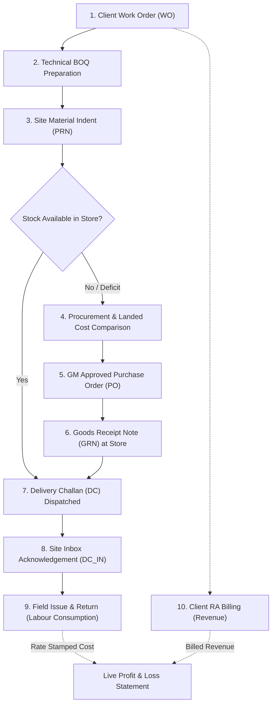

# AJ Power ERP — System Architecture, User Journeys & Workflow Guide

## 1. Executive Summary & Core Architectural Philosophy

**AJ Power ERP** is an end-to-end Enterprise Resource Planning system specifically engineered for Electrical Contracting, Infrastructure, and Engineering, Procurement & Construction (EPC) projects. 

Unlike generic manufacturing or retail ERPs, AJ Power ERP reflects the operational realities of electrical project sites:
- Clients contract for high-level functional scopes (e.g. *"Supply and installation of 100 socket points"*).
- Sites execute these scopes by consuming hundreds of physical components (boxes, conduits, copper wires, switches, fasteners).
- Material is held across central warehouses, in-transit lorries, and local site stores.
- Costs include both inventory consumption and field overheads (transport, fuel, tools, generator repairs, food).
- Revenue is only earned when work is measured and billed against client contracts via Running Account (RA) bills.

---

### Key Architectural Invariants

1. **Zero Stored Running Balances (Derived Truth)**
   - Balances are **never** stored as mutable numbers in rows. Stock quantities, pending orders, transit quantities, consumed balances, and unbilled amounts are dynamically derived from immutable transaction ledgers and views (`v_stock_balance`, `v_indent_item_flow`, `v_consumption_event`, `v_cost_event`, `v_billing_line`).
   - This eliminates data synchronization bugs, race conditions, and ledger drift.

2. **Strict Point-in-Time Rate Stamping**
   - Whenever inventory moves or is consumed, the document stamps the unit rate in effect on that exact date from the central store.
   - An expense statement or cost audit for last month will **never** alter historically when new inventory is bought at a higher or lower price today.

3. **Strict Separation of Commercials and Site Operations**
   - **Client Domain**: Work orders and client billing operate strictly in the client's terminology, contracted units, and agreed contract rates.
   - **Site Domain**: Site personnel see only **quantities**. Purchase rates, markups, and margins are completely hidden from site screens to eliminate site disputes.

4. **Defensive Mathematical Precision**
   - Quantities: `DECIMAL(18,3)` (millimeter, meter, kilogram accuracy without floating-point errors).
   - Currency: `DECIMAL(18,2)` (exact rupee and paisa tracking).

---

## 2. Technology Stack & Directory Structure

```
ajpowererpsoftware/
├── backend/                  # Node.js + Express + MySQL 8
│   ├── src/
│   │   ├── config/           # Database pool & transaction helpers (db.js)
│   │   ├── db/
│   │   │   ├── migrations/   # 23 progressive SQL schema & view migrations
│   │   │   ├── seeds/        # Reference seed data (branches, users, 2,600+ items)
│   │   │   └── setup.js      # Boot-time migration & seed runner
│   │   ├── lib/              # Audit logging, rate engine, doc numbering, error handlers
│   │   ├── middleware/       # Zod schema validation & async route wrapper
│   │   ├── modules/          # 20 feature-based Express route controllers
│   │   ├── app.js            # Express app configuration
│   │   └── index.js          # HTTP server bootstrap (:4000)
├── frontend/                 # React (Vite) Single Page Application
│   ├── src/
│   │   ├── components/       # Reusable design system (Table, Modal, Meter, Tag, Banner, etc.)
│   │   ├── pages/            # 23 functional screens across 6 departments
│   │   ├── api.js            # Fetch wrapper with error normalization & user header
│   │   ├── App.jsx           # Master shell, department rail, tab navigation, global state
│   │   └── styles.css        # Vanilla CSS design system with custom tokens
├── docs/
│   ├── API.md                # Comprehensive endpoint and parameter documentation
│   └── APPLICATION_WORKFLOW_AND_USER_JOURNEY.md # This guide
└── docker-compose.yml        # Local MySQL 8 database service container
```

---

## 3. User Personas & Roles

| Persona | Department | Primary Responsibilities |
| :--- | :--- | :--- |
| **Planning Engineer** *(e.g., Suresh Rao)* | **Planning** | Creates sites; sets client, site head, storekeeper, and GM; parses and locks client Work Orders; prepares item-level BOQs; manages amendments. |
| **Site Engineer / PM** *(e.g., Ravi Kumar, Vikram Nair)* | **Site** | Raises Indents (PRNs) against the approved BOQ; monitors delivery status; submits field expense claims (petty cash). |
| **Site Storekeeper** | **Site** | Receives shipments in the Site Inbox; signs Delivery Challan acknowledgements; issues material to named field labor; takes in unused returns. |
| **Central Storekeeper** *(e.g., Imran Sheikh)* | **Store** | Inspects supplier deliveries; confirms Goods Receipt Notes (GRN); maintains warehouse stock; dispatches Delivery Challans (DC) to sites. |
| **Procurement Officer** | **Procure** | Consolidates approved site indents; requests supplier quotes; prepares landed rate comparisons; drafts Purchase Orders (PO). |
| **General Manager (GM)** *(e.g., Anil Menon)* | **Management** | Signs off on Site creation; approves BOQ overrun limits; authorizes Purchase Orders; reviews and approves/cuts site expense claims. |
| **Billing Engineer** | **Billing** | Tracks completed site execution; generates sequential Running Account (RA) bills against client Work Order lines; handles credit deductions. |
| **Finance Director / Management** | **Reports** | Audits live project costs (Material Consumed + Site Expenses) against billed revenue; inspects real-time gross margin and Profit & Loss. |

---

## 4. End-to-End Application Lifecycle (The 10-Step Workflow)



---

## 5. Detailed Step-by-Step Module Walkthroughs

### Phase 1: Planning & Project Initiation

#### 1.1 Master Data Management
- **Item Master** (`/items`): Over 2,600 electrical items categorized by trade code (`ARM` for Armoured Cable, `WIR` for Wire, `MCB` for Miniature Circuit Breakers).
  - *Duplicate Guard*: Combines exact normalized string matching (`norm_key`) with permutation token sorting (`sort_key`) to prevent duplicate items (e.g. `1.5 sqmm red wire` vs `wire red 1.5 sqmm`).
- **Store & Branch Management** (`/stores`, `/sites`): Configures central distribution warehouses and regional branch hubs.

#### 1.2 Creating a Project Site (`/sites/new`)
- Every project site requires four distinct role associations:
  1. **Branch**: The commercial and tax entity (e.g., Hyderabad, Bengaluru).
  2. **Site Head**: The project engineer responsible on-site.
  3. **Site Storekeeper**: The custodian responsible for materials.
  4. **General Manager (GM)**: Enforced by database constraint (`ck_site_gm`). A site without a designated GM is rejected.

#### 1.3 Ingesting the Client Work Order (`/sites/:id`)
- Client scope documents (Excel/CSV) are uploaded and parsed by `/work-orders/parse`.
- The Work Order records the client's official terms:
  - Client line description, UOM, and contracted quantity.
  - Supply rate and installation rate.
- Once created, the Work Order is permanently **LOCKED**. It represents the client's legal agreement and cannot be tampered with.

---

### Phase 2: Technical Estimation & BOQ Preparation

#### 2.1 The BOQ Recipe (`/boq`)
- A client does not buy individual electrical screws, boxes, or raw wire; they buy installed scope. The BOQ bridges this gap.
- For each Work Order line, the Planning Engineer builds a component breakdown:
  $$\text{boq\_qty} = \text{item\_qty} \times \text{work\_order\_line\_qty}$$
  $$\text{est\_qty} = \text{planned procurement allowance}$$

#### 2.2 Overrun Allowances & Hard Stops
- When submitting a BOQ, the planner configures the overrun ceiling:
  - **Hard Stop (`overAllow: false`)**: The site cannot indent a single unit beyond the estimate.
  - **Tolerated Overrun (`overAllow: true, overPct: 10`)**: The site can indent up to 10% over estimate with warning tags.
  - **No Ceiling (`overAllow: true, overPct: 0`)**: Unlimited overrun permitted.

#### 2.3 BOQ Amendments (`/boq/amend`)
- If client drawings change or scope expands, amendments are entered **against the Work Order Line**, not individual items.
- The system automatically recalculates the underlying component quantities proportionally:
  $$\text{boq\_qty} = \text{item\_qty} \times (\text{contracted\_qty} + \text{amendment\_qty})$$
- The original contracted quantities remain untouched on the record for client audit purposes.

---

### Phase 3: Site Material Indenting (PRNs)

#### 3.1 Raising Site Requisitions (`/indents`)
- The Site Engineer accesses the Indent Cart for their site.
- The cart displays the full BOQ, showing estimated quantities, previously indented quantities, and current balances.
- **Evaluation Pre-Check** (`POST /indents/evaluate`): A dry-run analysis categorizes items:
  - `none`: Within estimate.
  - `warn`: Exceeds estimate but within agreed tolerance.
  - `bad`: Violates hard-stop or exceeds maximum ceiling.

#### 3.2 Indent Lifecycle & Pipeline Impact
```
DRAFT ──► SUBMITTED ──► APPROVED ──► FULFILLED
  ▲            │
  └─ RETURNED ◄┘ (with note)
```
- **Quantity Allocation Rule**: Only `SUBMITTED` and `APPROVED` indents hold allocated quantity in the demand pipeline. Drafts do not consume allowance.
- Upon approval, the indent generates an automatic **Rollup**: duplicate items across multiple BOQ lines are merged into a single consolidated line for store fulfilment and purchasing.

---

### Phase 4: Procurement & Sourcing

#### 4.1 Demand Consolidation & Shelf Check (`/procurement`)
- The Procurement Officer views all open, approved indents across sites.
- The buying sheet (`POST /procurement/demand`) displays:
  - Total demanded quantity.
  - Quantity already in central warehouse stock (`storeQty`).
  - Valuation rate (`storeRate`) and last purchase price (`lastPaidRate`).
  - *Decision*: If the warehouse has sufficient stock, the buyer routes demand to central stores instead of purchasing new inventory.

#### 4.2 Landed Rate Comparison (`/comparisons`)
- Quotations from multiple suppliers are entered into a comparative matrix.
- **Landed Cost Formula**:
  $$\text{Basic Amount} = \sum (\text{Rate} \times \text{Quantity})$$
  $$\text{Landed Cost} = \text{Basic Amount} - (\text{Basic Amount} \times \text{Discount \%}) + \text{Consignment Freight}$$
- The system highlights the lowest basic quote vs. the lowest landed cost.
- **Audit Rule**: Selecting any supplier other than the lowest landed cost requires entering an explicit justification (e.g., credit terms, delivery speed).

#### 4.3 Purchase Order Authorization (`/purchase-orders`)
- Orders are generated and linked to specific Indents (`po_line_indents`).
- Approval Workflow:
  ```
  DRAFT ──► SUBMITTED ──► APPROVED (GM Signature)
    ▲            │
    └─ RETURNED ◄┘ (with remark)
  ```
- **GM Signature Enforcement**: Suppliers receive orders only after the GM signs. Storekeepers cannot generate receipts against unsigned orders.

---

### Phase 5: Central Store Operations & Logistics

#### 5.1 Goods Receipt Note (GRN) (`/grns`)
- Upon arrival of the vendor's shipment, the central storekeeper opens the GRN Desk.
- The storekeeper records the supplier challan/invoice number, inspected quantities, and notes.
- Confirming the GRN writes entries to `stock_movements` and immediately updates store inventory balances.
- The unit rate is stamped from the PO, establishing the new valuation baseline for that item.

#### 5.2 Delivery Challans (DC) to Sites (`/challans`, `/store/prns`)
- The central storekeeper reviews the "PRNs to Fulfil" queue.
- Items are packed, and a Delivery Challan is generated with vehicle and driver details.
- Once marked **DISPATCHED**:
  - Quantities immediately decrement from the Central Store inventory.
  - Material enters **IN TRANSIT** status.
  - The item remains in transit until the receiving site formally signs for it.

---

### Phase 6: Site Store Inward & Acknowledgement

#### 6.1 Site Store Inbox (`/site/inbox`)
- The Site Storekeeper monitors incoming shipments.
- Displays all dispatches directed to the site (Store Delivery Challans and direct-to-site supplier PO deliveries).

#### 6.2 Inspection & Acknowledgement (`/site/inbox`)
- Physical goods are verified off the truck.
- **Partial Acknowledgements**: If 100 meters were shipped but only 80 arrived intact, the storekeeper signs for 80 (`PART_ACK`). The remaining 20 remain in transit until investigated.
- Acknowledging writes a `DC_IN` movement record, officially taking custody into the Site Store inventory. Site stock screens display quantities only—monetary values are suppressed.

---

### Phase 7: Site Field Consumption (Issues & Returns)

#### 7.1 Issuing Material to Field Labour (`/site/issue`)
- When workers draw materials from the site storage shed, the storekeeper records an issue.
- **Field Usability**: Issues are recorded against the **name of the person** drawing the material (e.g., "Ramesh Kumar"), without forcing site staff to identify the underlying BOQ line number.
- **Stock Constraint**: The system verifies that the site store currently holds sufficient inventory.
- **Rate Stamping**: The system stamps the unit rate currently in effect from the central store for that movement date.

#### 7.2 Returns of Unused Material (`/site/returns`)
- Unused cables, conduits, or fixtures brought back to the shed are recorded as Returns.
- **Anti-Theft Person Binding**: Returns must be logged against the specific individual who originally drew the material (`consumption_id` or `returned_by_name`). A return cannot exceed what that person currently holds.
- **Cost Reversal**: The return reduces consumed quantities and credits project costs at the current rate.

#### 7.3 Site Material Audit & Traceability (`/site/audit`, `/site/transactions`)
- Provides comprehensive audit visibility:
  - **Item Audit**: Tracks the complete history of an item across warehouses, challans, sites, and personnel.
  - **Person Audit**: Displays all materials drawn by an individual worker, current unreturned balances, and return history.

---

### Phase 8: Site Field Expenses (Petty Cash)

#### 8.1 Claiming Expenses (`/site/expenses`)
- Tracks non-material operational expenses incurred at the site (lorry hire, diesel, generator maintenance, municipal fees, worker meals).
- Claims record the category, date, description, recipient, bill number, and claimed amount.

#### 8.2 Review, Cuts & Approvals
- Expense claims follow an explicit approval lifecycle:
  ```
  DRAFT ──► SUBMITTED ──► APPROVED / PART_APPROVED / REJECTED / RETURNED
  ```
- **Partial Approval**: Approvers can reduce a claim (e.g., approving ₹3,200 of a ₹4,000 claim). Both the original claim and approved amount are preserved on record.
- **Unapproved Rule**: Unapproved or pending claims are never counted toward project costs until officially signed off.

---

### Phase 9: Client Billing (Running Account Bills)

#### 9.1 Measuring & Billing Work Orders (`/billing`)
- Client billing is generated against client **Work Order lines**, using client terms and contracted supply/installation rates.
- The billing sheet displays:
  - Agreed contract quantity.
  - Previously billed cumulative quantities.
  - Remaining billable balance.
  - Current bill quantity input.

#### 9.2 Running Account (RA) Sequence & Revenue Locking
- Bills are generated in strict sequential order for each site (RA-1, RA-2, RA-3...).
- Over-billing is prevented by database constraints: cumulative billed quantities cannot exceed the contracted Work Order amount (unless amended).
- Marking a bill as **RAISED** locks the invoice, generates a client-facing certificate, and officially recognizes revenue in the system.

---

### Phase 10: Financial Reporting & True Profit & Loss

#### 10.1 Project Expense Statement (`/reports/expense`)
- Consolidates total project execution costs:
  1. **Material Consumed**: Net physical consumption ($\text{Issues} - \text{Returns}$) multiplied by the stamped unit rate on each movement date.
  2. **Direct Labour**: Approved labour claims.
  3. **Site Overheads**: Approved category expenses (Fuel, Transport, Equipment Hire).
- The statement presents an itemized breakdown with separate running totals across selected date windows.

#### 10.2 Real-Time Profit & Loss (`/reports/pl`)
- **Revenue Integrity Rule**: P&L calculations require verified revenue from raised RA bills rather than unbilled contract agreements.
- When bills are active, the report provides a gross margin comparison:
  $$\text{Gross Profit} = \text{Billed Revenue (Supply + Installation)} - (\text{Material Consumed} + \text{Approved Expenses})$$
  $$\text{Gross Margin \%} = \frac{\text{Gross Profit}}{\text{Billed Revenue}} \times 100$$
- Unbilled Work Order balances are tracked as backlog commitments rather than earned income.

---

## 6. Frontend Architecture & Shell Layout

The frontend uses a two-tier navigation structure:
1. **Department Rail (Left)**: Icons for the 6 primary operational areas:
   - **Planning** (`/sites`, `/stores`, `/boq`, `/items`)
   - **Site** (`/indents`, `/site/inbox`, `/site/stock`, `/site/issue`, `/site/returns`, `/site/transactions`, `/site/audit`, `/site/consumption`, `/site/expenses`)
   - **Store** (`/store`, `/store/prns`, `/grns`, `/challans`, `/stock`, `/movements`)
   - **Billing** (`/billing`, `/billing/bills`)
   - **Reports** (`/reports/expense`, `/reports/pl`)
   - **Procure** (`/procurement`, `/comparisons`, `/purchase-orders`, `/suppliers`)
2. **Top Application Bar**:
   - **Branch Selector**: Filters the active commercial entity (e.g., Hyderabad, Bengaluru).
   - **Store Selector**: Appears dynamically when working in the Store department to select the active warehouse.
   - **User Switcher ("Working as")**: Switches the acting user profile to assign author signatures on generated documents.
   - **Status Badges**: Displays notification counts for pending actions (amendments due, indents waiting, pending expenses).

---

## 7. Master Route & Endpoint Reference Matrix

| Department | UI Path | Primary Controller | Key API Endpoints | Core Operations |
| :--- | :--- | :--- | :--- | :--- |
| **Planning** | `/sites`, `/sites/new`, `/sites/:id` | `sites.routes.js` | `GET /sites`, `POST /sites`, `PATCH /sites/:id` | Site, team, and warehouse configuration |
| **Planning** | `/sites/:id` | `workorders.routes.js` | `POST /work-orders/parse`, `POST /work-orders`, `GET /work-orders/site/:id` | Work Order upload, parsing, and locking |
| **Planning** | `/boq` | `boq.routes.js` | `POST /boq/prepare`, `PUT /boq/:id/wo-line/:woLineId`, `POST /boq/:id/submit` | Component recipes, overrun policies, BOQ locking |
| **Planning** | `/boq` | `boq.routes.js` | `GET /boq/:id/amend-sheet`, `POST /boq/:id/amendments` | Scope amendments at Work Order line level |
| **Planning** | `/items` | `items.routes.js` | `GET /items`, `POST /items`, `GET /items/search` | Item catalog and duplicate token prevention |
| **Site** | `/indents` | `indents.routes.js` | `POST /indents/evaluate`, `POST /indents`, `POST /indents/:id/decide` | Material requisitions, budget checks, approvals |
| **Procure** | `/procurement` | `procurement.routes.js` | `GET /procurement/queue`, `POST /procurement/demand` | Open indent consolidation and store stock checks |
| **Procure** | `/comparisons` | `comparisons.routes.js` | `POST /comparisons`, `PUT /comparisons/:id/quotes`, `POST /comparisons/:id/decide` | Quotation comparisons and landed cost calculation |
| **Procure** | `/purchase-orders` | `purchaseorders.routes.js`| `POST /purchase-orders`, `POST /purchase-orders/:id/decide` | Order creation and GM approval sign-off |
| **Store** | `/grns` | `grn.routes.js` | `GET /grns/desk`, `POST /purchase-orders/:id/receipts`, `POST /grns/:id/confirm` | Vendor shipment inspection, stock intake |
| **Store** | `/store/prns`, `/challans`| `challans.routes.js` | `GET /store/prns`, `POST /challans`, `POST /challans/:id/dispatch` | PRN fulfilment and Delivery Challan dispatch |
| **Site Store** | `/site/inbox` | `sitestore.routes.js` | `GET /site-store/:siteId/inbox`, `POST /challans/:id/acknowledge` | Inbound verification, partial receipts, custody transfer |
| **Site Store** | `/site/issue`, `/site/returns`| `consumption.routes.js`| `POST /consumption/issues`, `POST /consumption/returns` | Field issuance to labour, unused returns, rate stamping |
| **Site** | `/site/expenses` | `expenses.routes.js` | `POST /expenses`, `POST /expenses/:id/decide` | Site petty cash claims and approval/adjustment |
| **Site** | `/site/transactions`, `/site/audit`| `tracking.routes.js` | `GET /tracking/transactions`, `GET /tracking/audit/item/:itemId`, `GET /tracking/audit/person` | Complete item and person material audit trails |
| **Billing** | `/billing`, `/billing/bills` | `bills.routes.js` | `GET /bills/sheet/:siteId`, `POST /bills`, `POST /bills/:id/raise` | Running Account (RA) billing against contract lines |
| **Reports** | `/reports/expense` | `costs.routes.js` | `GET /costs/expense/statement`, `GET /costs/expense` | Realized project cost reporting |
| **Reports** | `/reports/pl` | `costs.routes.js` | `GET /costs/pl` | Real-time Gross Profit and Margin percentage analysis |
