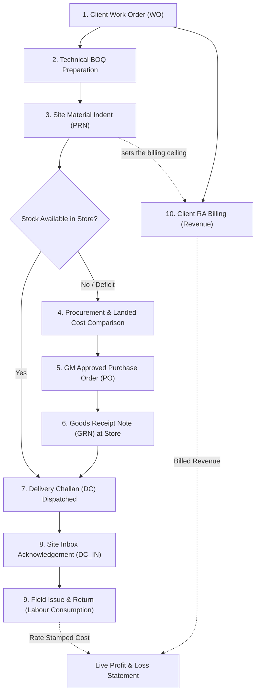

# AJ Power ERP — System Architecture, User Journeys & Workflow Guide

## 1. Executive Summary & Core Architectural Philosophy

**AJ Power ERP** is an end-to-end Enterprise Resource Planning system specifically engineered for Electrical Contracting, Infrastructure, and Engineering, Procurement & Construction (EPC) projects.

Unlike generic manufacturing or retail ERPs, AJ Power ERP reflects the operational realities of electrical project sites:
- Clients contract for high-level functional scopes (e.g. *"Supply and installation of 100 socket points"*).
- Sites execute these scopes by consuming hundreds of physical components (boxes, conduits, copper wires, switches, fasteners).
- Material is held across central warehouses, in-transit lorries, and local site stores.
- Costs include both inventory consumption and field overheads (transport, fuel, tools, generator repairs, food).
- Revenue is only earned when work is measured and billed against client contracts via Running Account (RA) bills.

---

### Key Architectural Invariants

1. **Zero Stored Running Balances (Derived Truth)**
   - Balances are **never** stored as mutable numbers in rows. Stock quantities, pending orders, transit quantities, consumed balances, and unbilled amounts are dynamically derived from immutable transaction ledgers and views (`v_stock_balance`, `v_indent_item_flow`, `v_consumption_event`, `v_cost_event`, `v_billing_line`).
   - This eliminates data synchronization bugs, race conditions, and ledger drift.

2. **Strict Point-in-Time Rate Stamping**
   - Whenever inventory moves — in **either** direction — the document stamps the unit rate the central store held that item at **on the date of that movement**, not the date it was typed in. A slip written up late and dated last Tuesday prices at last Tuesday's rate.
   - An expense statement or cost audit for last month will **never** alter historically when new inventory is bought at a higher or lower price today.
   - A consequence worth stating: an item that moved on several days has **several** rates, so no single rate for it exists. Dividing total cost by total quantity would produce an average that was never the price of anything, which is why the expense statement shows quantity and amount but **no rate column**.

3. **Strict Separation of Commercials and Site Operations**
   - **Client Domain**: Work orders and client billing operate strictly in the client's terminology, contracted units, and agreed contract rates.
   - **Site Domain**: Site screens show **quantities only** — no rates, no values. Purchase rates, markups, and margins are hidden from Issue, Returns, Site Store, Transactions, Audit and Consumption to eliminate site disputes. Every rate is still stamped and stored; the Reports department is what answers for money.
   - **The single exception** is Site → Expenses. A petty-cash claim *is* a rupee figure somebody typed, so it cannot be shown without money — and that is precisely why it is the one site document requiring approval.

4. **Defensive Mathematical Precision**
   - Quantities: `DECIMAL(18,3)` (millimeter, meter, kilogram accuracy without floating-point errors).
   - Currency: `DECIMAL(18,2)` (exact rupee and paisa tracking).

---

## 2. Technology Stack & Directory Structure

```
ajpowererpsoftware/
├── backend/                  # Node.js + Express + MySQL 8
│   ├── src/
│   │   ├── config/           # Database pool & transaction helpers (db.js)
│   │   ├── db/
│   │   │   ├── migrations/   # 23 progressive SQL schema & view migrations
│   │   │   ├── seeds/        # Reference seed data (branches, users, 2,607 items)
│   │   │   └── setup.js      # Boot-time migration & seed runner
│   │   ├── lib/              # Audit logging, rate engine, doc numbering, error handlers
│   │   ├── middleware/       # Zod schema validation & async route wrapper
│   │   ├── modules/          # 20 feature-based Express route controllers
│   │   ├── app.js            # Express app configuration
│   │   └── index.js          # HTTP server bootstrap (:4000)
├── frontend/                 # React (Vite) Single Page Application
│   ├── src/
│   │   ├── components/       # Reusable design system (Table, Modal, Meter, Tag, Banner,
│   │   │                     #   ClientPicker, and hand-rolled SVG charts)
│   │   ├── pages/            # 23 functional screens across 6 departments
│   │   ├── api.js            # Fetch wrapper with error normalization & user header
│   │   ├── App.jsx           # Master shell, department rail, tab navigation, global state
│   │   └── styles.css        # Vanilla CSS design system with custom tokens
├── docs/
│   ├── API.md                # Comprehensive endpoint and parameter documentation
│   └── APPLICATION_WORKFLOW_AND_USER_JOURNEY.md # This guide
└── docker-compose.yml        # Local MySQL 8 database service container
```

The project carries **no UI dependencies** beyond React and the router. Charts are
hand-rolled inline SVG reading the same CSS variables as the rest of the design
system, so they stay correct when the palette moves.

---

## 3. User Personas & Roles

| Persona | Department | Primary Responsibilities |
| :--- | :--- | :--- |
| **Planning Engineer** *(e.g., Suresh Rao)* | **Planning** | Creates sites; sets client, site head, storekeeper, and GM; parses and locks client Work Orders; prepares item-level BOQs; manages amendments and overrun ceilings. |
| **Site Engineer / PM** *(e.g., Ravi Kumar, Vikram Nair)* | **Site** | Raises Indents (PRNs) against the approved BOQ; monitors delivery status; submits field expense claims (petty cash). |
| **Site Storekeeper** | **Site** | Receives shipments in the Site Inbox; signs Delivery Challan acknowledgements; issues material to named field labour; takes in unused returns. |
| **Central Storekeeper** *(e.g., Imran Sheikh)* | **Store** | Inspects supplier deliveries; confirms Goods Receipt Notes (GRN); maintains warehouse stock; dispatches Delivery Challans (DC) to sites. |
| **Procurement Officer** | **Procure** | Consolidates approved site indents; requests supplier quotes; prepares landed rate comparisons; drafts Purchase Orders (PO). |
| **General Manager (GM)** *(e.g., Anil Menon)* | **Management** | Signs off on Site creation; approves BOQ overrun limits; authorizes Purchase Orders; reviews and approves/cuts site expense claims. |
| **Billing Engineer** | **Billing** | Tracks completed site execution; generates sequential Running Account (RA) bills against client Work Order lines; cancels and re-raises where a certificate is disputed. |
| **Finance Director / Management** | **Reports** | Audits live project costs (Material Consumed + Labour + Site Expenses) against billed revenue; inspects real-time gross margin and Profit & Loss. |

> **No permission checks exist anywhere in the system yet.** Who may approve an
> indent, sign a purchase order or cut an expense is a decision that has not
> been taken, and guessing at it would mean building screens around rules that
> change. What every document *does* record is **who decided** — the part that
> has to be true whenever the rules do arrive. The "Working as" switcher in the
> top bar only chooses whose name goes on a document.

---

## 4. End-to-End Application Lifecycle (The 10-Step Workflow)



> Note the dotted line from **Indent** to **Billing**. The indent is not only a
> request for material — it is what sets the ceiling on what may be invoiced.
> See §9.2.

---

## 5. Detailed Step-by-Step Module Walkthroughs

### Phase 1: Planning & Project Initiation

#### 1.1 Master Data Management
- **Item Master** (`/items`): 2,607 electrical items categorized by trade code (`ARM` for Armoured Cable, `WIR` for Wire, `MCB` for Miniature Circuit Breakers).
  - *Duplicate Guard*: Combines exact normalized string matching (`norm_key`) with permutation token sorting (`sort_key`) to prevent duplicate items (e.g. `1.5 sqmm red wire` vs `wire red 1.5 sqmm`).
- **Store & Branch Management** (`/stores`, `/sites`): Configures central distribution warehouses and regional branch hubs.
- **Clients**: Added inline, wherever one is picked. The only moment anybody discovers a client is missing is halfway through creating a site, so the `ClientPicker` offers **"+ Add a client"** — name, GSTIN and branch in a dialog — and selects the new client when it closes, losing nothing already typed. A duplicate name is refused with `409` *and the existing client's id*, so the picker simply selects that one rather than making the user read an error and go hunting.

#### 1.2 Creating a Project Site (`/sites/new`)
- Every project site requires four distinct role associations:
  1. **Branch**: The commercial and tax entity (e.g., Hyderabad, Bengaluru).
  2. **Site Head**: The project engineer responsible on-site.
  3. **Site Storekeeper**: The custodian responsible for materials.
  4. **General Manager (GM)**: Enforced by database constraint (`ck_site_gm`). A site without a designated GM is rejected.

#### 1.3 Ingesting the Client Work Order (`/sites/:id`)
- Client scope documents (Excel/CSV) are uploaded and parsed by `/work-orders/parse`. Headers are matched on their wording, so the client's own sheet usually imports untouched.
- The Work Order records the client's official terms:
  - Client line description, UOM, and contracted quantity.
  - Supply rate and installation rate.
- Once created, the Work Order is permanently **LOCKED**. It represents the client's legal agreement and cannot be tampered with. Scope changes are recorded as BOQ amendments (§2.3), which never touch `work_order_lines.qty`.

---

### Phase 2: Technical Estimation & BOQ Preparation

#### 2.1 The BOQ Recipe (`/boq`)
- A client does not buy individual electrical screws, boxes, or raw wire; they buy installed scope. The BOQ bridges this gap.
- For each Work Order line, the Planning Engineer builds a component breakdown:
  $$\text{boq\_qty} = \text{item\_qty} \times \text{work\_order\_line\_qty}$$
  $$\text{est\_qty} = \text{planned procurement allowance}$$

#### 2.2 Overrun Allowances & Hard Stops
- When submitting a BOQ, the planner configures the overrun ceiling. **This is the system's only lock on quantity**, and everything downstream inherits it:
  - **Hard Stop (`overAllow: false`)**: The site cannot indent a single unit beyond the estimate.
  - **Tolerated Overrun (`overAllow: true, overPct: 10`)**: The site can indent up to 10% over estimate with warning tags.
  - **No Ceiling (`overAllow: true, overPct: 0`)**: Unlimited overrun permitted.

#### 2.3 BOQ Amendments (`/boq/amend`)
- If client drawings change or scope expands, amendments are entered **against the Work Order Line**, not individual items.
- The system automatically recalculates the underlying component quantities proportionally:
  $$\text{boq\_qty} = \text{item\_qty} \times (\text{contracted\_qty} + \text{amendment\_qty})$$
- The original contracted quantities remain untouched on the record for client audit purposes. Both figures are readable side by side — `original_value` is what was signed, `contract_value` is what the line is worth now.
- **An amendment raises what is agreed; it does not raise what can be billed.** The extra quantity still needs material indented for it first. See §9.2.

---

### Phase 3: Site Material Indenting (PRNs)

#### 3.1 Raising Site Requisitions (`/indents`)
- The Site Engineer accesses the Indent Cart for their site.
- The cart displays the full BOQ, showing estimated quantities, previously indented quantities, and current balances.
- **Evaluation Pre-Check** (`POST /indents/evaluate`): A dry-run analysis categorizes items:
  - `none`: Within estimate.
  - `warn`: Exceeds estimate but within agreed tolerance.
  - `bad`: Violates hard-stop or exceeds maximum ceiling.

#### 3.2 Indent Lifecycle & Pipeline Impact
```
DRAFT ──► SUBMITTED ──► APPROVED ──► FULFILLED
  ▲            │
  └─ RETURNED ◄┘ (with note)
```
- **Quantity Allocation Rule**: Only `SUBMITTED` and `APPROVED` indents hold allocated quantity in the demand pipeline. Drafts do not consume allowance.
- Upon approval, the indent generates an automatic **Rollup**: duplicate items across multiple BOQ lines are merged into a single consolidated line for store fulfilment and purchasing.
- **The indent is also the billing ceiling.** An approved indent is what tells Billing that work on a line is genuinely being executed; see §9.2.

---

### Phase 4: Procurement & Sourcing

#### 4.1 Demand Consolidation & Shelf Check (`/procurement`)
- The Procurement Officer views all open, approved indents across sites.
- The buying sheet (`POST /procurement/demand`) displays:
  - Total demanded quantity.
  - Quantity already in central warehouse stock (`storeQty`).
  - Valuation rate (`storeRate`) and last purchase price (`lastPaidRate`).
  - *Decision*: If the warehouse has sufficient stock, the buyer routes demand to central stores instead of purchasing new inventory.

#### 4.2 Landed Rate Comparison (`/comparisons`)
- Quotations from multiple suppliers are entered into a comparative matrix.
- **Landed Cost Formula**:
  $$\text{Basic Amount} = \sum (\text{Rate} \times \text{Quantity})$$
  $$\text{Landed Cost} = \text{Basic Amount} - (\text{Basic Amount} \times \text{Discount \%}) + \text{Consignment Freight}$$
- The system highlights the lowest basic quote vs. the lowest landed cost.
- **Audit Rule**: Selecting any supplier other than the lowest landed cost requires entering an explicit justification (e.g., credit terms, delivery speed).

#### 4.3 Purchase Order Authorization (`/purchase-orders`)
- Orders are generated and linked to specific Indents (`po_line_indents`).
- Approval Workflow:
  ```
  DRAFT ──► SUBMITTED ──► APPROVED (GM Signature)
    ▲            │
    └─ RETURNED ◄┘ (with remark)
  ```
- **GM Signature Enforcement**: Suppliers receive orders only after the GM signs. Storekeepers cannot generate receipts against unsigned orders. A `SUBMITTED` order holds the quantity (so it cannot be ordered twice) without it counting as ordered.

---

### Phase 5: Central Store Operations & Logistics

#### 5.1 Goods Receipt Note (GRN) (`/grns`)
- Upon arrival of the vendor's shipment, the central storekeeper opens the GRN Desk.
- The storekeeper records the supplier challan/invoice number, inspected quantities, and notes.
- Confirming the GRN writes entries to `stock_movements` and immediately updates store inventory balances.
- The unit rate is stamped from the PO, establishing the new valuation baseline for that item.

#### 5.2 Delivery Challans (DC) to Sites (`/challans`, `/store/prns`)
- The central storekeeper reviews the "PRNs to Fulfil" queue.
- Items are packed, and a Delivery Challan is generated with vehicle and driver details.
- Once marked **DISPATCHED**:
  - Quantities immediately decrement from the Central Store inventory.
  - Material enters **IN TRANSIT** status.
  - The item remains in transit until the receiving site formally signs for it. In transit belongs to nobody, and it stays on both screens until somebody accounts for it.

---

### Phase 6: Site Store Inward & Acknowledgement

#### 6.1 Site Store Inbox (`/site/inbox`)
- The Site Storekeeper monitors incoming shipments.
- Displays all dispatches directed to the site (Store Delivery Challans and direct-to-site supplier PO deliveries).

#### 6.2 Inspection & Acknowledgement (`/site/inbox`)
- Physical goods are verified off the truck.
- **Partial Acknowledgements**: If 100 meters were shipped but only 80 arrived intact, the storekeeper signs for 80 (`PART_ACK`). The remaining 20 remain in transit until investigated.
- Acknowledging writes a `DC_IN` movement record, officially taking custody into the Site Store inventory. Site stock screens display quantities only — monetary values are suppressed.

---

### Phase 7: Site Field Consumption (Issues & Returns)

#### 7.1 Issuing Material to Field Labour (`/site/issue`)
- When workers draw materials from the site storage shed, the storekeeper records an issue.
- **Field Usability**: Issues are recorded against the **name of the person** drawing the material (e.g., "Ramesh Kumar"), without forcing site staff to identify the underlying BOQ line number. The name is **typed**, because there is no site login yet and the people drawing material are often not system users at all — but the picker offers back every name that site has already used, so the second issue to Ramesh is a click rather than a fourth spelling. `issued_to_user_id` is reserved for when site attendance arrives.
- **Stock Constraint**: The system verifies that the site store currently holds sufficient inventory, checked inside the transaction so two people issuing the last coil cannot both win.
- **Rate Stamping**: The line is stamped with the central store rate **for the document's date**. No rate or value is shown on the screen.

#### 7.2 Returns of Unused Material (`/site/returns`)
- Unused cables, conduits, or fixtures brought back to the shed are recorded as Returns.
- **The person is chosen, never typed.** By the time material comes back, the system already recorded exactly who it went to — so the screen lists only the people actually holding something at that site, and the items only what that person took and has not brought back. A name not on that list has nothing to return.
- **A return never names an issue document.** Nobody remembers which slip material left on days later; asking means they pick the first one and the link looks authoritative while being wrong. The `consumption_id` column was removed from `stock_returns` for exactly this reason (migration 018).
- **Cost Reversal**: The return credits project cost at the central store rate **on the return date** — the same rule as an issue, so both sides of a day are struck at the same price. No money is shown on the return screen.
- **Issued and not returned is consumed.** Nothing is called an outstanding balance, because it is not one: material put into somebody's hands has been used. The remaining quantity exists only to cap a return so it cannot invent stock that never left.

#### 7.3 Site Material Audit & Traceability (`/site/transactions`, `/site/audit`, `/site/consumption`)
- Three views of one ledger, so they cannot disagree with each other:
  - **Transactions**: every movement of every item — receipt, challan, acknowledgement, issue, return — filterable by site, kind, direction, item, person and date window.
  - **Audit**: either *an item* (everywhere it has been, where it is standing now, who has used it) or *a person* (every line they signed for with dates, folded by item). Because names are typed, the audit reports which **spellings** a loose search swept up rather than silently adding two people together; case is folded by the database collation, so "ramesh kumar" and "Ramesh Kumar" are one person.
  - **Consumption**: net consumed — issued less returned — by item, for a single day or any window, with a running total.
- All three show **quantities only**.

---

### Phase 8: Site Field Expenses (Petty Cash)

#### 8.1 Claiming Expenses (`/site/expenses`)
- Tracks non-material operational expenses incurred at the site (lorry hire, diesel, generator maintenance, municipal fees, worker meals, labour gangs).
- Claims record the category, date, description, recipient, bill number, and claimed amount.
- Categories carry a `kind` of `LABOUR` or `OTHER`, so the cost statement can section labour off without keying on a category's name. Reclassifying "Hire charges" as labour is one row changed, not a query edited.

#### 8.2 Review, Cuts & Approvals
- Expense claims follow an explicit approval lifecycle:
  ```
  DRAFT ──► SUBMITTED ──► APPROVED / REJECTED / RETURNED
    ▲            │
    └─ RETURNED ◄┘ (with reason) ── and can be sent again
  ```
- **Partial Approval**: Approvers can reduce a claim (e.g., approving ₹3,200 of a ₹4,000 claim). Both figures stay on the one document — `PART_APPROVED` is *derived* from them, never stored — so "how much of what sites asked for was granted" remains answerable.
- **Approving more than was claimed is refused.** Cutting a claim down is an approval; adding to it is a different document.
- **A cut, a refusal or a send-back requires a reason.** The site will ask, and "the system does not say" is not an answer.
- **`approved_amount` is NULL until somebody decides — never 0.** A claim nobody has looked at is not the same as one refused.
- **Unapproved Rule**: Pending claims never reach a cost figure. They are reported *separately* on the expense report, with their value and how long the oldest has waited, so nobody mistakes one for the other.

---

### Phase 9: Client Billing (Running Account Bills)

#### 9.1 Measuring & Billing Work Orders (`/billing`)
- Client billing is raised against client **Work Order lines**, not items: the client agreed to supply and install a hundred socket points, they did not agree to buy metal boxes. Quantities are in their units, at their rates, against their wording.
- The billing sheet displays, per line:

  | Column | Meaning |
  | :--- | :--- |
  | **BOQ qty** | Agreed — contracted plus any amendment |
  | **Indented** | Material indented for, translated into the client's units — **this is the ceiling** |
  | **Billed** | Cumulative across every raised bill |
  | **Left to bill** | `indented − billed` |
  | **Rate** | Supply + installation, from the work order |
  | **Billing now** | The entry column |

- Bills are found by number, site, **client name**, or the client's own certificate reference; the register also filters by client directly.

#### 9.2 What May Be Billed — the Indent Ceiling

**There is one ceiling: what material has been indented for.**

$$\text{may be billed} = \text{indented} - \text{already billed}$$

Work nobody has asked for material for has not been done, and invoicing it is how a running account bill gets thrown back. Billing past the indent is refused, and the message says what to do about it:

> *Line 1 — Socket point with back box: 60 No's has been indented for and 0 is already billed, so 60 can be billed. Indent the rest before invoicing it.*

**The agreed quantity is not a second ceiling, and running past it is not an error.** A work order is written before the work is measured — the client is estimating their own requirement, and on this kind of job it goes over. The indent is what reflects what was actually needed, so the billing follows the indent. Over-indenting requires a BOQ that permits it (§2.2), so the quantity reaching a client's bill was already permitted twice: once by whoever set the BOQ ceiling, and once by whoever approved the indent. Billing adds no third gate.

It is not silent, though. `over_contract_qty` names the part running past the order, and the sheet reports it plainly — *"₹13,500 beyond the work order has been indented for, and is billable"* — because somebody will eventually ask how a line came to be billed at 115% of what was signed.

**Translating indents into the client's units.** Indents are raised per *item*, and a work order line is not an item — it is 100 socket points, each needing one box and two plates. `v_wo_line_indented` therefore takes the **least-provisioned item**: boxes in for 80 points but plates for only 60 means **60 points**, not 80.

**The identity every line satisfies:**

$$\text{agreed} + \text{past the order} = \text{billed} + \text{can be billed} + \text{waiting on material}$$

`unprovisioned_qty` ("waiting on material") is measured from whichever of indented/billed has got further, *not* from the agreed quantity. The two look equivalent and are not: a line billed past its indent — which happens, and did before this rule existed — would otherwise count the same work twice and the row would not add up. `over_billed_qty` names that condition instead of hiding it; those bills are with the client so nothing is undone, but no more goes on that line until the material is indented for.

#### 9.3 Running Account (RA) Sequence & Revenue Locking
- Bills run in strict sequence per site: RA 1, RA 2, RA 3. `uq_bill_ra (site_id, ra_no)` means two people pressing **Raise** at the same moment cannot take the same number.
- A bill reads the way an RA bill is meant to — **up to the last bill · this bill · to date** — via `previous_qty` on `v_bill_line`.
- `DRAFT` holds nothing. Only **RAISED** is revenue.
- Rates are **stamped onto the bill line** from the work order, so a later correction upstream can never reprice an invoice already with the client.
- A raised bill can be **cancelled with a reason**. Its revenue stops counting and the quantity becomes free to bill again. Bills come off in the order they went on — RA 2 cannot be cancelled while RA 3 stands — so the running total can never be reconstructed wrongly.
- There is **no retention, deduction or tax handling** on a bill yet.

---

### Phase 10: Financial Reporting & True Profit & Loss

#### 10.1 Project Cost Statement (`/reports/expense`)
Laid out the way a cost statement is always laid out, and the download matches it exactly:

```
MATERIAL CONSUMED     one row per item — net quantity and amount
  Total material
LABOUR                one row per approved claim, with the comments on it
  Total labour
OTHER EXPENSES        the same, grouped by what they were for
  Total other
TOTAL
```

1. **Material Consumed** — listed **per item**, not per issue ("what did the cable cost" is the question; forty slips is not an answer). The amount is the **sum of each movement priced at its own day's rate**, net of returns. There is deliberately **no rate column**: see §1.2.
2. **Labour** and 3. **Other Expenses** — one row per *approved claim*, because there the document is the answer. Each row carries what the site wrote (`note`), what the approver wrote back (`decision_note`), the site, and both the claimed and approved figures, so a cut shows its own reason on its own line.

A **Statement / Charts** toggle switches to the same numbers as donuts (material vs labour vs other; expenses by kind), a line graph of the three moving against each other, and a running-total column chart. A window also reports what was spent *before* it, so "to date" is a real running total however narrow the window.

#### 10.2 Real-Time Profit & Loss (`/reports/pl`)
- **Revenue Integrity Rule**: revenue comes from **raised RA bills only** — not work orders, which are agreements, and not drafts, which are working notes. Subtracting cost from an agreement is how a business persuades itself it is profitable while running out of money.
- Before the first bill, the screen refuses to exist and says why in one sentence, with a way through to Billing and to the expense report. It takes a **site and nothing else** — no date filter, because a window over nothing is still nothing.
- Once billed:
  $$\text{Gross Profit} = \text{Billed Revenue (Supply + Installation)} - (\text{Material Consumed} + \text{Labour} + \text{Approved Expenses})$$
  $$\text{Gross Margin \%} = \frac{\text{Gross Profit}}{\text{Billed Revenue}} \times 100$$
- `orderValue` — the order book — is struck on the **amended** quantity, the same one billing works to. Using the original `work_order_lines.line_total` makes "not yet billed" come out negative on an amended site.

---

## 6. Frontend Architecture & Shell Layout

The frontend uses a two-tier navigation structure:

1. **Department Rail (Left)** — six built departments, in rail order:
   - **Planning** (`/sites`, `/stores`, `/boq`, `/items`)
   - **Site** (`/indents`, `/site/inbox`, `/site/stock`, `/site/issue`, `/site/returns`, `/site/transactions`, `/site/audit`, `/site/consumption`, `/site/expenses`)
   - **Store** (`/store`, `/store/prns`, `/grns`, `/challans`, `/stock`, `/movements`)
   - **Billing** (`/billing`, `/billing/bills`)
   - **Reports** (`/reports/expense`, `/reports/pl`)
   - **Procure** (`/procurement`, `/comparisons`, `/purchase-orders`, `/suppliers`)

   **Accounts** is named and greyed below the separator — the one department still to come. It is not stubbed, because an empty screen is worse than no screen.

2. **Top Application Bar**:
   - **Branch Selector**: Filters the active commercial entity (e.g., Hyderabad, Bengaluru).
   - **Store Selector**: Appears dynamically when working in the Store department to select the active warehouse.
   - **User Switcher ("Working as")**: Switches the acting user profile to assign author signatures on generated documents.
   - **Status Badges**: Displays notification counts for pending actions (amendments due, indents waiting, expense claims waiting to be decided).

Report and audit filters live in the **URL**, so a filtered screen can be sent to somebody and arrive the same way.

---

## 7. Master Route & Endpoint Reference Matrix

| Department | UI Path | Primary Controller | Key API Endpoints | Core Operations |
| :--- | :--- | :--- | :--- | :--- |
| **Planning** | `/sites`, `/sites/new`, `/sites/:id` | `sites.routes.js` | `GET /sites`, `POST /sites`, `PATCH /sites/:id`, `GET /sites/stores/list` | Site, team, and warehouse configuration |
| **Planning** | `/sites/new` | `masters.routes.js` | `GET /masters/clients`, `POST /masters/clients` | Inline client creation with duplicate guard |
| **Planning** | `/sites/:id` | `workorders.routes.js` | `POST /work-orders/parse`, `POST /work-orders`, `GET /work-orders/site/:id` | Work Order upload, parsing, and locking |
| **Planning** | `/boq` | `boq.routes.js` | `POST /boq/prepare`, `PUT /boq/:id/wo-line/:woLineId`, `POST /boq/:id/submit` | Component recipes, overrun policies, BOQ locking |
| **Planning** | `/boq` | `boq.routes.js` | `GET /boq/:id/amend-sheet`, `POST /boq/:id/amendments` | Scope amendments at Work Order line level |
| **Planning** | `/items` | `items.routes.js` | `GET /items`, `POST /items`, `GET /items/search` | Item catalog and duplicate token prevention |
| **Site** | `/indents` | `indents.routes.js` | `POST /indents/evaluate`, `POST /indents`, `POST /indents/:id/decide` | Material requisitions, ceiling checks, approvals |
| **Procure** | `/procurement` | `procurement.routes.js` | `GET /procurement/queue`, `POST /procurement/demand` | Open indent consolidation and store stock checks |
| **Procure** | `/comparisons` | `comparisons.routes.js` | `POST /comparisons`, `PUT /comparisons/:id/quotes`, `POST /comparisons/:id/decide` | Quotation comparisons and landed cost calculation |
| **Procure** | `/purchase-orders` | `purchaseorders.routes.js`| `POST /purchase-orders`, `POST /purchase-orders/:id/decide` | Order creation and GM approval sign-off |
| **Store** | `/grns` | `grn.routes.js` | `GET /grns/desk`, `POST /purchase-orders/:id/receipts`, `POST /grns/:id/confirm` | Vendor shipment inspection, stock intake |
| **Store** | `/store/prns`, `/challans`| `challans.routes.js` | `GET /store/prns`, `POST /challans`, `POST /challans/:id/dispatch` | PRN fulfilment and Delivery Challan dispatch |
| **Site Store** | `/site/inbox` | `sitestore.routes.js` | `GET /site-store/:siteId/inbox`, `POST /challans/:id/acknowledge` | Inbound verification, partial receipts, custody transfer |
| **Site Store** | `/site/issue`, `/site/returns`| `consumption.routes.js`| `POST /consumption/issues`, `POST /consumption/returns`, `GET /consumption/issuable/:siteId`, `GET /consumption/returnable/:siteId`, `GET /consumption/people/:siteId` | Field issuance to labour, unused returns, rate stamping |
| **Site** | `/site/expenses` | `expenses.routes.js` | `POST /expenses`, `POST /expenses/:id/decide`, `GET /expenses/categories` | Site petty cash claims and approval/adjustment |
| **Site** | `/site/transactions`, `/site/audit`, `/site/consumption`| `tracking.routes.js` | `GET /tracking/transactions`, `GET /tracking/audit/item/:itemId`, `GET /tracking/audit/person`, `GET /tracking/consumed` | Complete item and person material audit trails |
| **Billing** | `/billing`, `/billing/bills` | `bills.routes.js` | `GET /bills/sites`, `GET /bills/sheet/:siteId`, `POST /bills`, `POST /bills/:id/raise`, `POST /bills/:id/cancel` | Running Account (RA) billing against contract lines |
| **Reports** | `/reports/expense` | `costs.routes.js` | `GET /costs/expense/statement`, `GET /costs/expense`, `GET /costs/expense/lines` | Realized project cost reporting |
| **Reports** | `/reports/pl` | `costs.routes.js` | `GET /costs/pl` | Real-time Gross Profit and Margin percentage analysis |

---

## 8. Key Derived Views

| View | Answers |
| :--- | :--- |
| `v_stock_balance` | What any site or store holds, and at what valuation |
| `v_stock_movement` | The ledger as a person reads it — what moved, where, why, on whose document |
| `v_boq_line_status` | Estimated, indented, committed, consumed and balance per BOQ line |
| `v_indent_item_flow` | Ordered, received, in transit, at site — per indent and item |
| `v_consumption_event` | Issues (+) and returns (−) on one signed ledger |
| `v_person_outstanding` | What one person took and has not brought back — the return cap |
| `v_site_expense` | A claim with its derived `outcome` and `disallowed_amount` |
| `v_cost_event` | Material and approved expenses on one cost ledger |
| `v_wo_line_indented` | Indents translated into the client's units, by least-provisioned item |
| `v_billing_line` | Agreed, indented, billed, billable, waiting, past-the-order — per WO line |
| `v_site_revenue` | Raised bills only. The revenue side of the P&L |

**211 backend tests** cover these flows end to end, including the arithmetic
identities above — a chart whose running line does not land on the number
printed beside it is treated as a defect.
